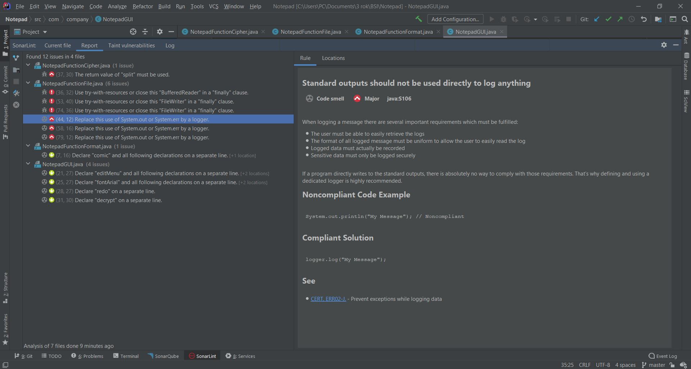

## The task is to check the code from selected repository against ***SEI CERT Java Coding Standard***.
_This Standard provides rules for secure coding in the Java programming language._

###### References:

[CERT Java Coding Standard](https://wiki.sei.cmu.edu/confluence/display/java/SEI+CERT+Oracle+Coding+Standard+for+Java) 

###### Selected application:

[https://github.com/ekaterinatrofa/Notepad](https://github.com/ekaterinatrofa/Notepad)


The selected tool for testing is ***SonarLint*** 
```
SonarLint is a Free and Open Source IDE extension that identifies and helps you fix quality and security issues as you code.

It will help you in following ways:
- Identify the new bugs and the quality issues in Java, typescript and javascript code. So, it’s like a good self-review of code changes.
- Code improvements and suggestions while writing code rather than running sonarQube afterwards.
- We can also run it for every class where we make any change.
- It can teach you what’s wrong with the code, show you best practices, and give you examples of fixes.
```
###### References: 

- [https://www.sonarlint.org/](https://www.sonarlint.org/)
- [https://medium.com/@tarunchhabra/using-sonarlint-with-sonarqube-in-intellij-ide-5128111d1b8d](https://medium.com/@tarunchhabra/using-sonarlint-with-sonarqube-in-intellij-ide-5128111d1b8d)

###### SonarLint report




###### CERT, DCL52-J. Do not declare more than one variable per declaration

---

_Noncompliant Code_

```java
Font arial, comic, times;
```

_Compliant Solution_

```java
Font arial;
Font comic;
Font times;
```

###### CERT, ERR02-J. - Prevent exceptions while logging data

---

_Noncompliant Code_

```java
try {
 // ....
} catch (Exception e) {
  System.out.println("ERROR!");
}
```

_Compliant Solution_

```java
try {
 // ....
} catch (Exception e) {
   logger.info("ERROR!");
}
```

###### CCERT, FIO04-J. - Release resources when they are no longer needed

---

_Noncompliant Code_

```java
 public void saveFile() {
        if (fileName == null) {
            saveAsFile();
        } else {
            try {
                FileWriter fileWriter = new FileWriter(fileAddress + fileName);
                fileWriter.write(notepadGUI.textNotepad.getText());
                notepadGUI.setTitle(fileName);
                fileWriter.close();
            } catch (Exception e) {
                System.out.println("ERROR!");
            }
        }
    }
```
_Compliant Solution_

```java
    public void saveFile() {
        if (fileName == null) {
            saveAsFile();
        } else {
            FileWriter fileWriter = null;
            try {
                fileWriter = new FileWriter(fileAddress + fileName);
                try{
                    fileWriter.write(notepadGUI.textNotepad.getText());
                    notepadGUI.setTitle(fileName);
                } finally {
                    fileWriter.close();
                }

            } catch (Exception e) {
                logger.info("ERROR!");
            }
        }
    }
```

###### CERT, EXP00-J. - Do not ignore values returned by methods

---

_Noncompliant Code_

```java
for (int i = 0; i < textBefore.length(); i++) {
     char c = chars[i];
     char encrypted = encrypt(c, key);
     textAfter = Character.toString(encrypted);
     textAfter.split("\\s");
     String[] outputArray = {textAfter};

     for (int index = 0; index < outputArray.length; index++) {
          notepadGUI.textNotepad.append(outputArray[index]);
     }
}
```

_Compliant Solution_

```java
for (int i = 0; i < textBefore.length(); i++) {
    char c = chars[i];
    char encrypted = encrypt(c, key);
    textAfter = Character.toString(encrypted);
    String[] outputArray = textAfter.split("\\s");

    for (int index = 0; index < outputArray.length; index++) {
         notepadGUI.textNotepad.append(outputArray[index]);
    }
}
```

More precise data is inside *[patch](https://github.com/ekaterinatrofa/BSI_calculator/blob/master/check_CERT_JAVA_Coding_Standard/cert_java.patch)*.


Author:

_Kateryna Trofymenko_